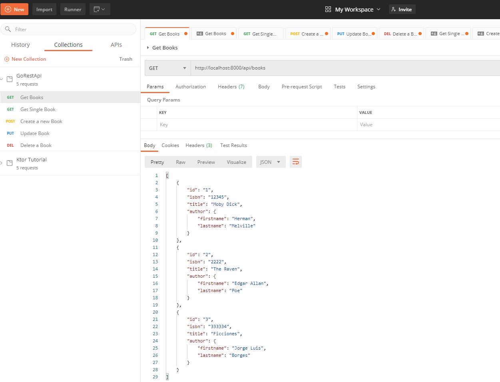

# RestApi-Golang

Simple Go RestApi in memory using [Mux](https://github.com/gorilla/mux)

## How to run

Build and run main.go:

```
go build
.\restapi.exe
```

Open postman collection and execute the different apis


